# tugas 1

### 1. Total buku seluruhnya
``` sql
SELECT COUNT(*) AS total_buku 
FROM buku;
```
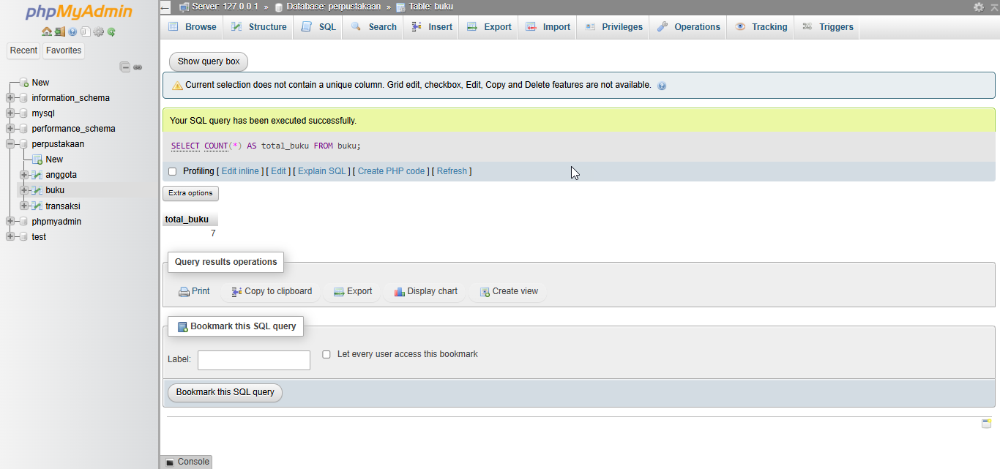

### 2. Total nilai inventaris (harga × stok)
```sql
SELECT SUM(harga * stok) AS total_inventaris 
FROM buku;
```
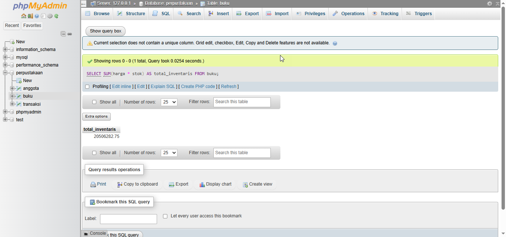

### 3. Rata-rata harga buku
```sql
SELECT AVG(harga) AS rata_rata_harga 
FROM buku;
```


### 4. Buku termahal (judul dan harga)
```sql
SELECT judul, harga 
FROM buku
ORDER BY harga DESC
LIMIT 1;
```
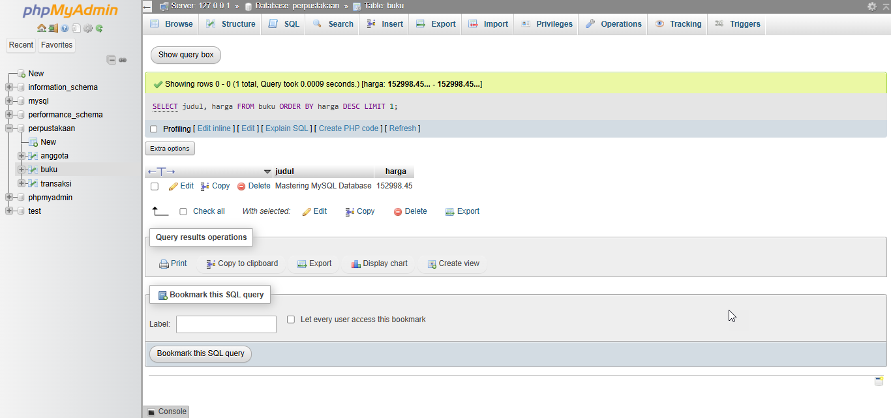

### 5. Buku dengan stok terbanyak
```sql
SELECT judul, stok 
FROM buku
ORDER BY stok DESC
LIMIT 1;
```
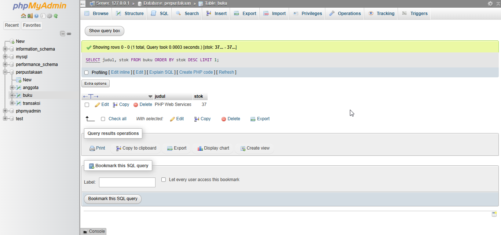

### 6. Buku kategori Programming dengan harga < 100000
```sql
SELECT * 
FROM buku
WHERE kategori = 'Programming' AND harga < 100000;
```
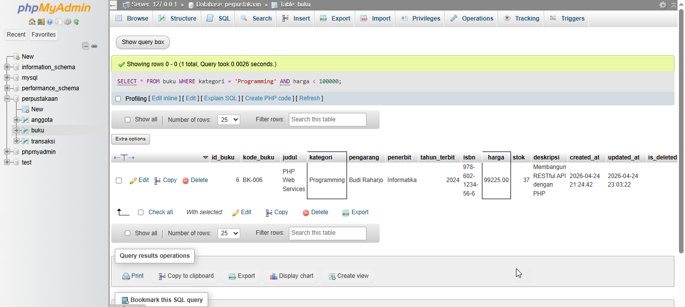

### 7. Buku dengan judul mengandung "PHP" atau "MySQL"
```sql
SELECT * 
FROM buku
WHERE judul LIKE '%PHP%' OR judul LIKE '%MySQL%';
```
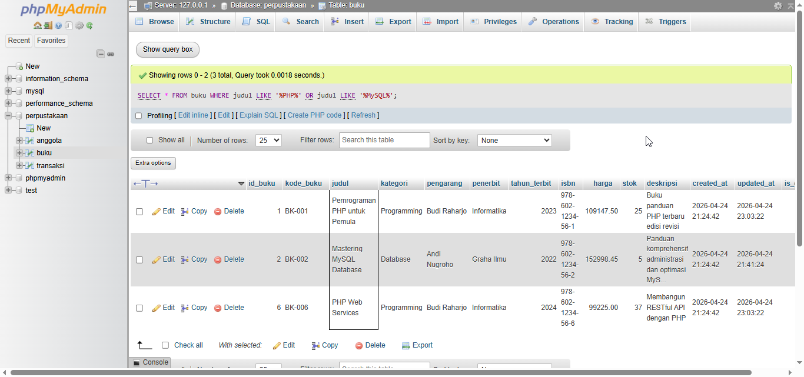

### 8. Buku terbit tahun 2024
```sql
SELECT * 
FROM buku
WHERE tahun_terbit = 2024;
```
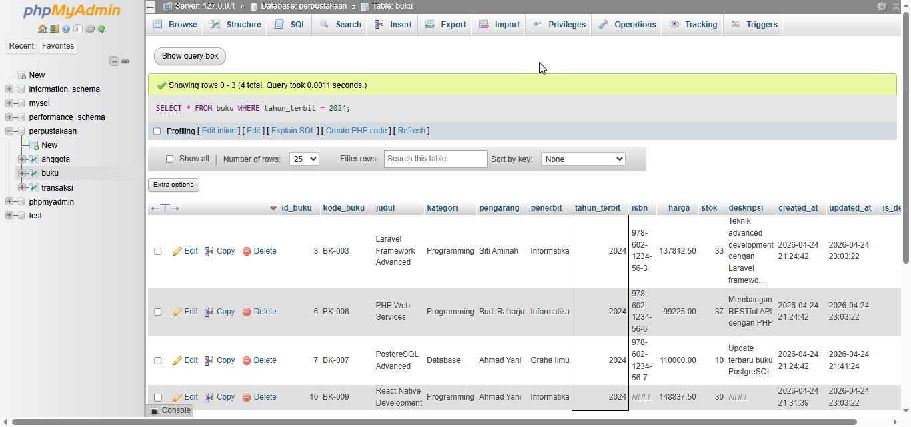

### 9. Buku dengan stok antara 5 - 10
```sql
SELECT * 
FROM buku
WHERE stok BETWEEN 5 AND 10;
```
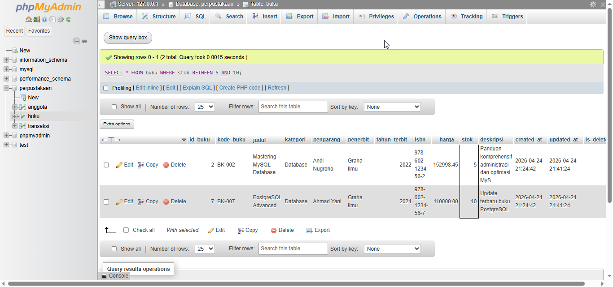

### 10. Buku dengan pengarang "Budi Raharjo"
```sql
SELECT * 
FROM buku
WHERE pengarang = 'Budi Raharjo';
```
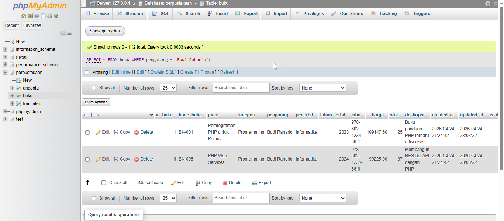

### 11. Jumlah buku & total stok per kategori
```sql
SELECT kategori, COUNT(*) AS jumlah_buku, SUM(stok) AS total_stok
FROM buku
GROUP BY kategori;
```
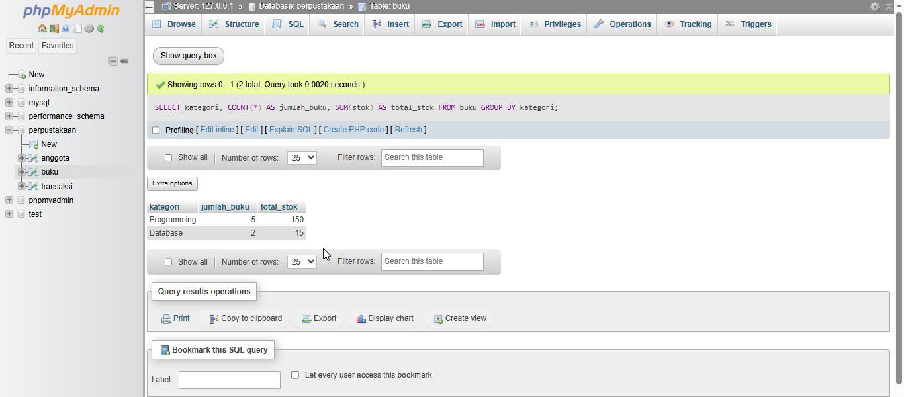

### 12. Rata-rata harga per kategori
```sql
SELECT kategori, AVG(harga) AS rata_rata_harga
FROM buku
GROUP BY kategori;
```
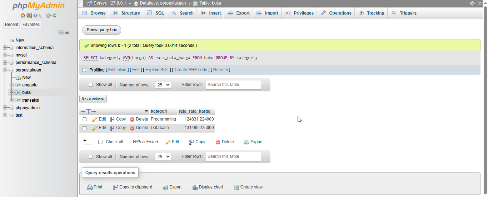

### 13. Kategori dengan total inventaris terbesar
```sql
SELECT kategori, SUM(harga * stok) AS total_inventaris
FROM buku
GROUP BY kategori
ORDER BY total_inventaris DESC
LIMIT 1;
```
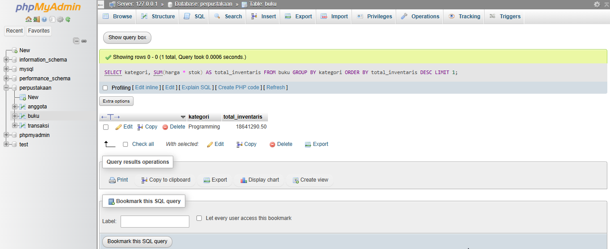

### 14. Naikkan harga kategori Programming sebesar 5%
```sql
UPDATE buku
SET harga = harga + (harga * 0.05)
WHERE kategori = 'Programming';
```
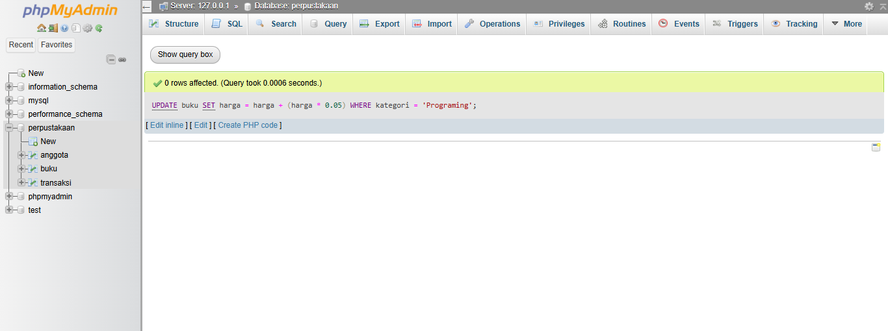

### 15. Tambah stok 10 untuk buku dengan stok < 5
```sql
SELECT * 
FROM buku
WHERE stok < 5
```
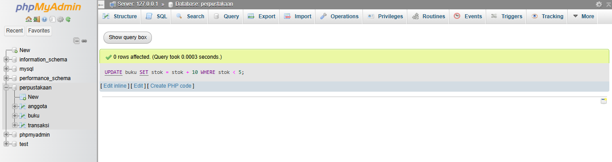

### 16. Buku yang perlu restocking (stok < 5)
```sql
SELECT * 
FROM buku
WHERE stok < 5;
```
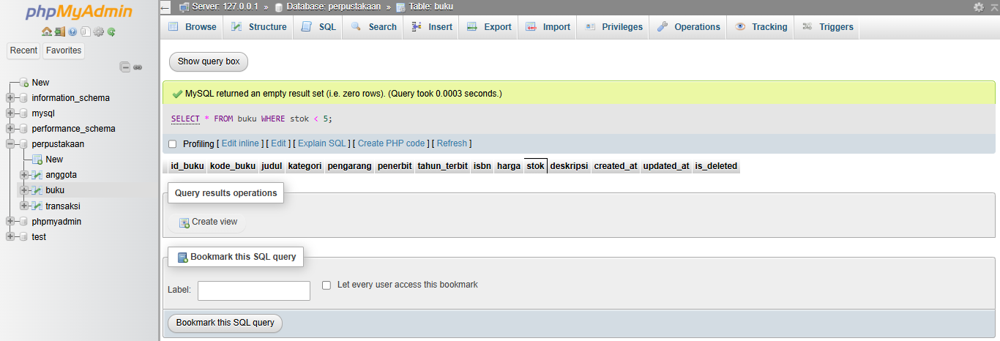

### 17. Top 5 buku termahal
```sql
SELECT judul, harga
FROM buku
ORDER BY harga DESC
LIMIT 5;
```
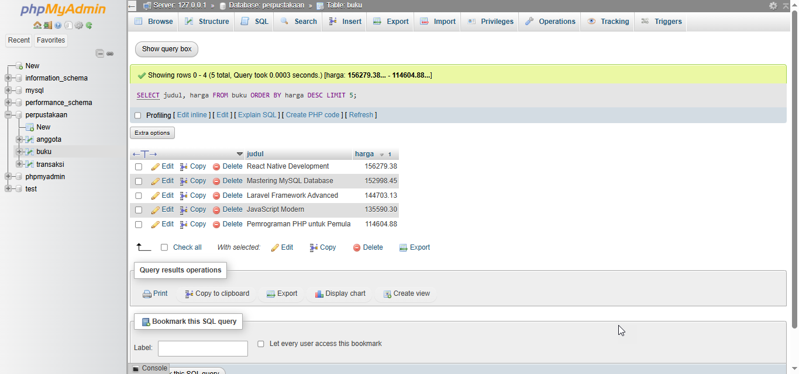


# tugas 2

### 1. PEMBUATAN DATABASE
```sql
CREATE DATABASE IF NOT EXISTS perpustakaan_lengkap;
USE perpustakaan_lengkap;
```
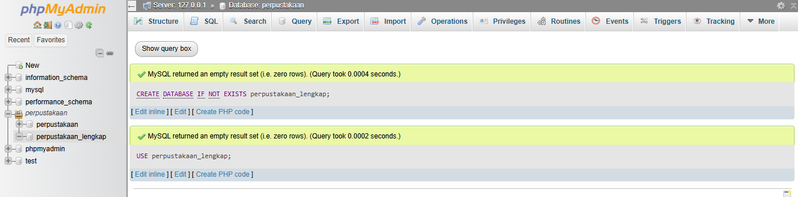

### 2. PEMBUATAN TABEL KATEGORI BUKU
```sql
CREATE TABLE kategori_buku (
    id_kategori INT AUTO_INCREMENT PRIMARY KEY,
    nama_kategori VARCHAR(50) NOT NULL UNIQUE,
    deskripsi TEXT,
    is_deleted TINYINT(1) DEFAULT 0, -- Soft Delete
    created_at TIMESTAMP DEFAULT CURRENT_TIMESTAMP
);
```
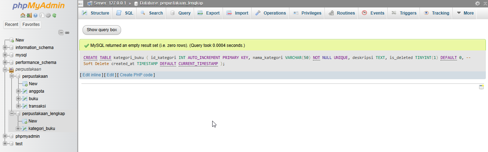

### 3. PEMBUATAN TABEL PENERBIT
```sql
CREATE TABLE penerbit (
    id_penerbit INT AUTO_INCREMENT PRIMARY KEY,
    nama_penerbit VARCHAR(100) NOT NULL,
    alamat TEXT,
    telepon VARCHAR(15),
    email VARCHAR(100),
    is_deleted TINYINT(1) DEFAULT 0, -- Soft Delete
    created_at TIMESTAMP DEFAULT CURRENT_TIMESTAMP
);
```
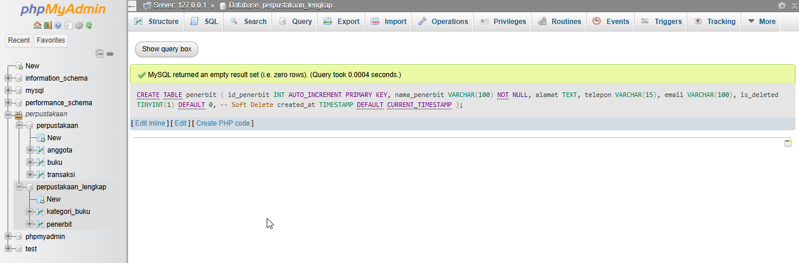

### 4. PEMBUATAN TABEL RAK (BONUS)
```sql
CREATE TABLE rak (
    id_rak INT AUTO_INCREMENT PRIMARY KEY,
    nama_rak VARCHAR(20) NOT NULL,
    lokasi VARCHAR(50),
    is_deleted TINYINT(1) DEFAULT 0 -- Soft Delete
);
```
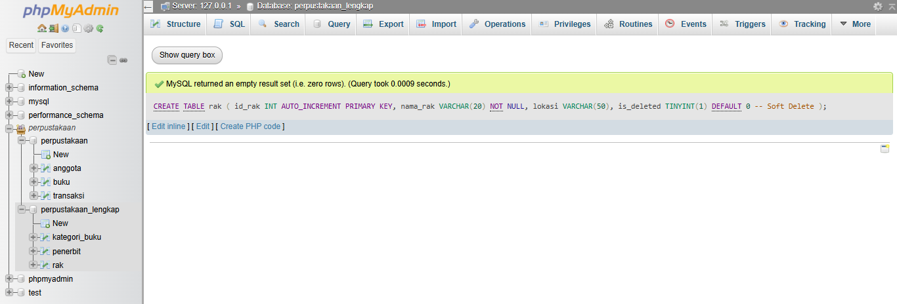

### 5. PEMBUATAN TABEL BUKU (DENGAN MODIFIKASI FOREIGN KEY)
```sql
CREATE TABLE buku (
    id_buku INT AUTO_INCREMENT PRIMARY KEY,
    judul VARCHAR(255) NOT NULL,
    pengarang VARCHAR(100),
    id_kategori INT,
    id_penerbit INT,
    id_rak INT, -- Bonus Relasi ke Rak
    tahun_terbit YEAR,
    harga DECIMAL(10,2),
    stok INT DEFAULT 0,
    is_deleted TINYINT(1) DEFAULT 0, -- Soft Delete
    created_at TIMESTAMP DEFAULT CURRENT_TIMESTAMP,
    FOREIGN KEY (id_kategori) REFERENCES kategori_buku(id_kategori) ON DELETE SET NULL,
    FOREIGN KEY (id_penerbit) REFERENCES penerbit(id_penerbit) ON DELETE SET NULL,
    FOREIGN KEY (id_rak) REFERENCES rak(id_rak) ON DELETE SET NULL
);
```
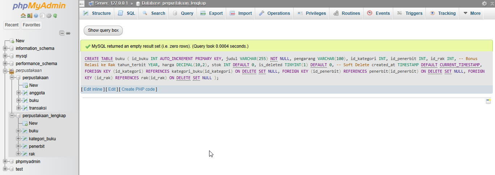

## 6. INSERT DATA SAMPLE
### - Kategori (5)
```sql
INSERT INTO kategori_buku (nama_kategori, deskripsi) VALUES 
('Programming', 'Buku tentang pengembangan perangkat keras dan lunak'),
('Sains', 'Ilmu pengetahuan alam dan matematika'),
('Fiksi', 'Novel dan cerita khayalan'),
('Sejarah', 'Catatan peristiwa masa lalu'),
('Agama', 'Buku-buku keagamaan dan spiritual');
```
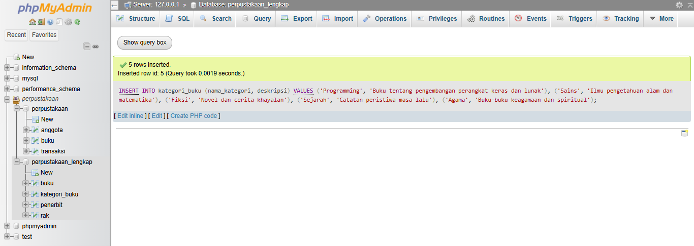

### - Penerbit (5)
```sql
INSERT INTO penerbit (nama_penerbit, alamat, email) VALUES 
('Erlangga', 'Jakarta', 'info@erlangga.com'),
('Gramedia', 'Jakarta', 'kontak@gramedia.com'),
('Informatika', 'Bandung', 'admin@informatika.id'),
('Andi Offset', 'Yogyakarta', 'cs@andioffset.com'),
('Mizan', 'Bandung', 'hello@mizan.com');
```
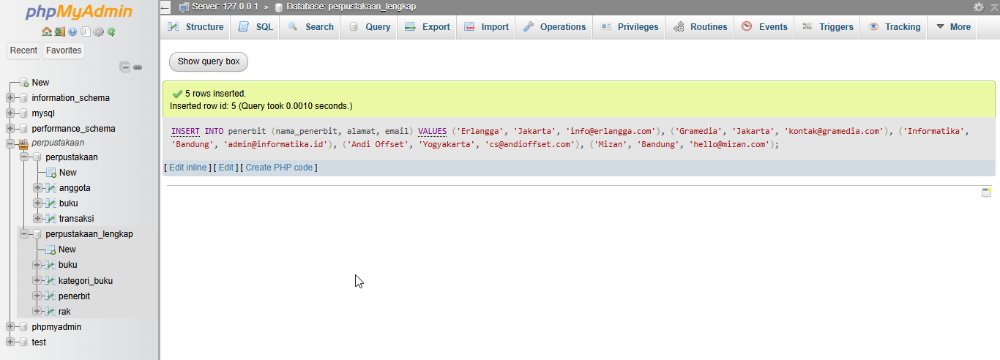

### - Rak (Bonus)
```sql
INSERT INTO rak (nama_rak, lokasi) VALUES 
('R001', 'Lantai 1 - Sayap Kiri'),
('R002', 'Lantai 1 - Sayap Kanan'),
('R003', 'Lantai 2 - Tengah');
```
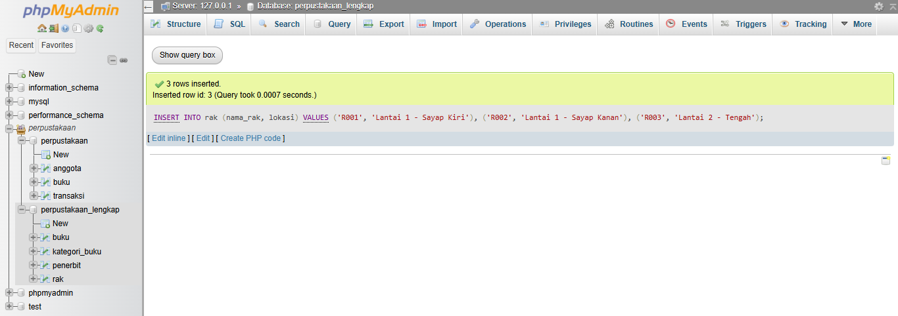

### - Buku (15)
```sql
INSERT INTO buku (judul, pengarang, id_kategori, id_penerbit, id_rak, tahun_terbit, harga, stok) VALUES 
('Belajar PHP 8', 'Budi Raharjo', 1, 3, 1, 2024, 95000, 10),
('Mastering MySQL', 'Ahmad Solikin', 1, 3, 1, 2024, 110000, 4),
('Algoritma Pemrograman', 'Rinaldi Munir', 1, 3, 1, 2023, 85000, 15),
('Fisika Dasar', 'Halliday', 2, 1, 2, 2022, 150000, 7),
('Laskar Pelangi', 'Andrea Hirata', 3, 2, 3, 2015, 75000, 20),
('Sejarah Dunia', 'HG Wells', 4, 1, 2, 2020, 125000, 3),
('Fiqih Islam', 'Sulaiman Rasjid', 5, 5, 2, 2018, 90000, 12),
('Web Design Modern', 'Dika', 1, 4, 1, 2024, 88000, 5),
('Kalkulus', 'Purcell', 2, 1, 2, 2021, 180000, 6),
('Bumi Manusia', 'Pramoedya', 3, 2, 3, 2010, 95000, 8),
('Sejarah Indonesia', 'M. C. Ricklefs', 4, 2, 2, 2019, 135000, 5),
('Tafsir Al-Mishbah', 'Quraish Shihab', 5, 5, 2, 2017, 250000, 4),
('Python For Data Science', 'Joko', 1, 4, 1, 2024, 105000, 9),
('Biologi SMA', 'Campbell', 2, 1, 2, 2023, 200000, 10),
('Negeri 5 Menara', 'A. Fuadi', 3, 2, 3, 2012, 80000, 15);
```
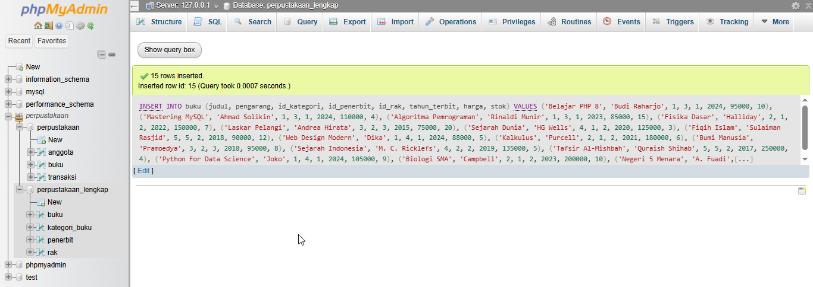

## 7. QUERY YANG DIMINTA
### - JOIN untuk tampilkan buku dengan nama kategori dan penerbit
```sql
SELECT b.judul, b.pengarang, k.nama_kategori, p.nama_penerbit
FROM buku b
JOIN kategori_buku k ON b.id_kategori = k.id_kategori
JOIN penerbit p ON b.id_penerbit = p.id_penerbit;
```
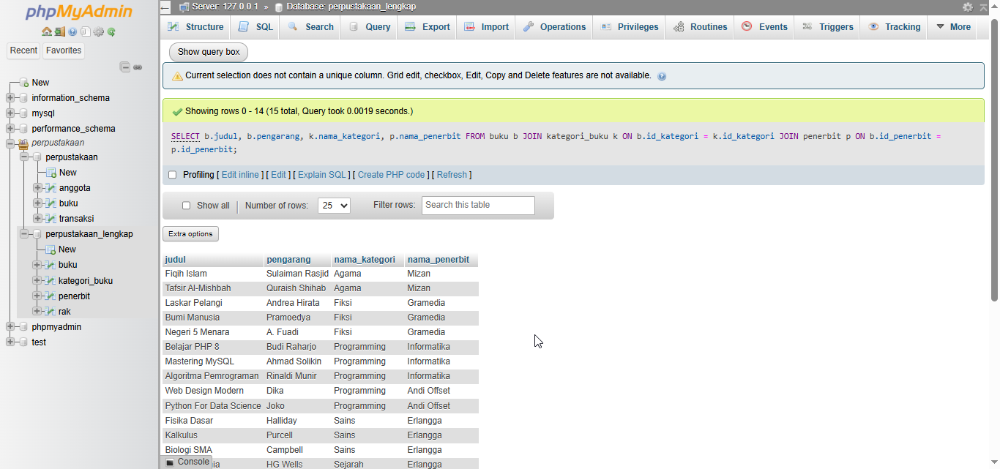

### - Jumlah buku per kategori
```sql
SELECT k.nama_kategori, COUNT(b.id_buku) AS jumlah_buku
FROM kategori_buku k
LEFT JOIN buku b ON k.id_kategori = b.id_kategori
GROUP BY k.nama_kategori;
```
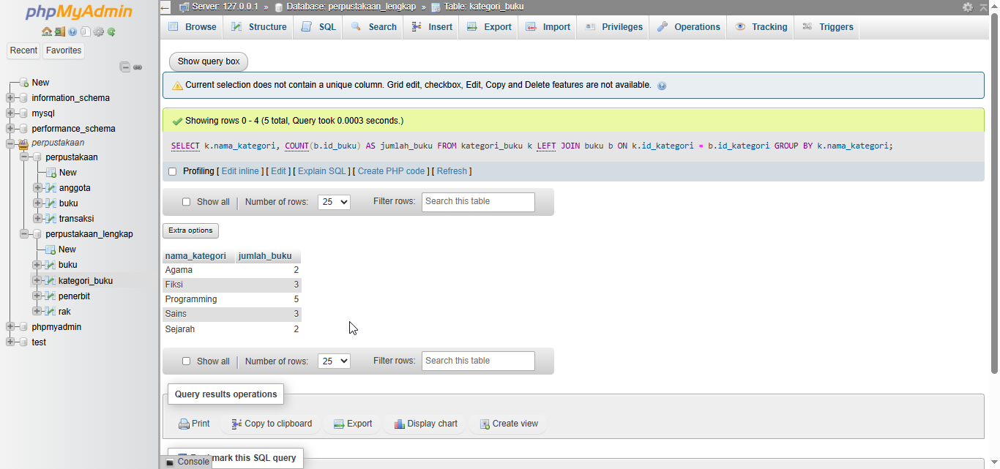

### - Jumlah buku per penerbit
```sql
SELECT p.nama_penerbit, COUNT(b.id_buku) AS jumlah_buku
FROM penerbit p
LEFT JOIN buku b ON p.id_penerbit = b.id_penerbit
GROUP BY p.nama_penerbit;
```


### - Buku beserta detail lengkap (kategori + penerbit + rak)
```sql
SELECT b.judul, k.nama_kategori, p.nama_penerbit, r.nama_rak, r.lokasi
FROM buku b
JOIN kategori_buku k ON b.id_kategori = k.id_kategori
JOIN penerbit p ON b.id_penerbit = p.id_penerbit
JOIN rak r ON b.id_rak = r.id_rak;
```
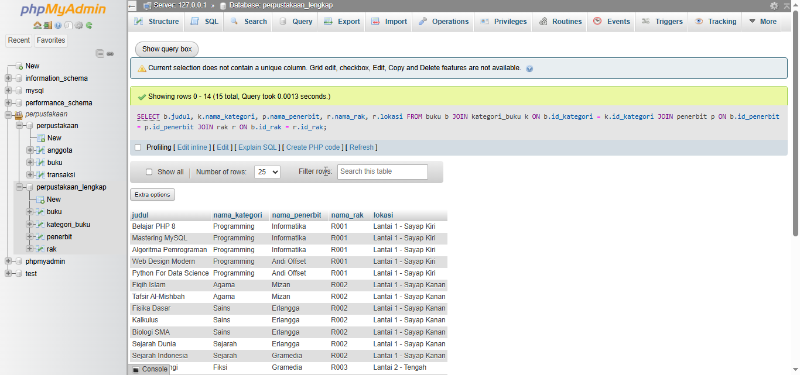

### 8. BONUS: STORED PROCEDURE
```sql
DELIMITER //
CREATE PROCEDURE GetBukuByKategori(IN kategoriName VARCHAR(50))
BEGIN
    SELECT b.judul, b.stok, b.harga
    FROM buku b
    JOIN kategori_buku k ON b.id_kategori = k.id_kategori
    WHERE k.nama_kategori = kategoriName;
END //
DELIMITER ;
```
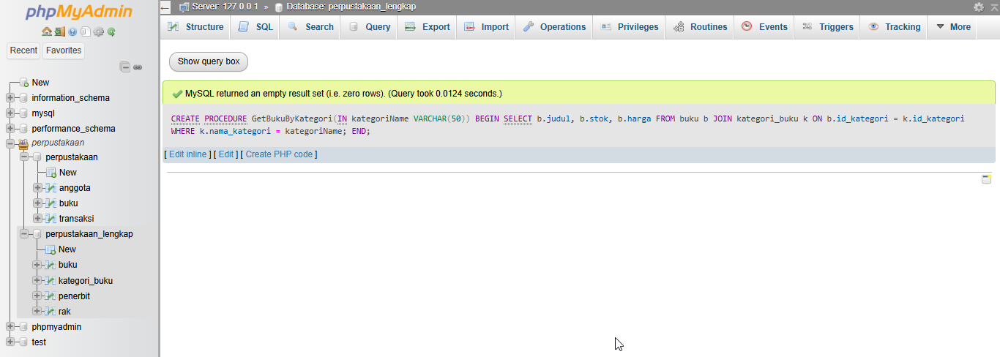